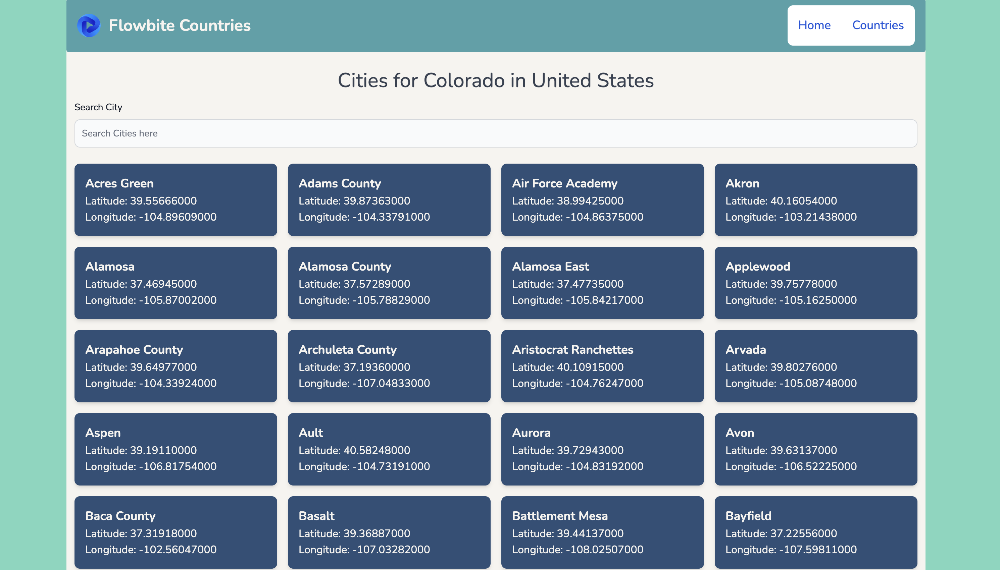

## Flowbite Countries - Database for countries, cities and states 

### Tech Stack

`Flowbite Countries` displays a huge list of states and cities from different countries around the world.

**Features**

- Huge database from the API provides data for 220+ countries, 70000 + cities and 5000 + states
- Flowbite UI is used for attractive loaders, navbars and more.
- Tailwind CSS is used for utility classes within the app.
- Search filtering added.

**Installation Options**
---

Just like you install majority of the Node powered front-end apps, three magic commands for you to run the app.

1. Install with npm
    + `$ npm install`
    + `$ npm start`
    + `$ npm build`

**Screenshots**
---

Country detail page which displays all the states of the given country.

State detail page for a given state and country would display all the cities located in the state and available in the database.

1. Get API Key

    + Go to this website - https://countrystatecity.in/
        - Request for an API key, you should have it in your mail in around 2 days.
    + Read the docs
        - Read the docs to get the grasp of API end-points and response received.
    + Use it in your app
        - Use it in your app through the env file. Append this in request headers while making API calls.

**How to Contribute**
---

1. Clone repo and create a new branch: `$ git checkout https://github.com/Apfirebolt/countries-and-states-database-app-in-React -b name_for_new_branch`.
2. Make changes and test
3. Submit Pull Request with comprehensive description of changes

**Time Taken**
---

The project took around 3 and half hours to complete from designing to analyzing API docs, creating UI and integrating APIs.

**Acknowledgements**
---

+ [Darshan Gada](https://github.com/dr5hn) for creating and maintaining this awesome API.

